# Modeling Human Inference of Simple Dynamical Rules: A Bayesian Program Induction Approach to Cellular Automata

[](LICENSE)
[](https://julialang.org/)
[](https://www.gen.dev/)
[](https://www.python.org/)
[](https://ocw.mit.edu/courses/9-660j-computational-cognitive-science-fall-2004/)

<p align="center">
  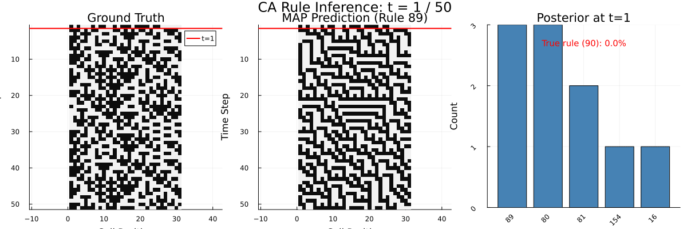
</p>

---

## Paper

<p align="center">
  <a href="paper/Edwards_MIT_9_660_Final_Project_Report.pdf">
    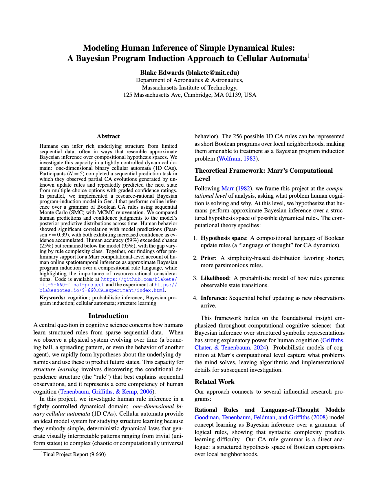
  </a>
</p>

<p align="center">
  <a href="paper/Edwards_MIT_9_660_Final_Project_Report.pdf">
    <strong>Read the Full Paper (PDF)</strong>
  </a>
</p>

---

## Overview

Humans can infer rich underlying structure from limited sequential data, often in ways that resemble approximate Bayesian inference over compositional hypothesis spaces. This project investigates that capacity in a tightly controlled dynamical domain: **one-dimensional binary cellular automata (1D CAs)**. Five participants completed a sequential prediction task in which they observed partial CA evolutions generated by unknown update rules and predicted the next state from multiple-choice options with graded confidence ratings.

In parallel, we implemented a **resource-rational Bayesian program-induction model** in [Gen.jl](https://www.gen.dev/) that performs online inference over a grammar of Boolean CA rules using **Sequential Monte Carlo (SMC) with MCMC rejuvenation**. Human behavior showed significant correlation with model predictions (Pearson *r* = 0.39), with both exhibiting increased confidence as evidence accumulated. Human accuracy (59%) exceeded chance (25%) but remained below the model (95%), with the gap varying by rule complexity class.

### Key Features

- **Grammar-Based Program Induction**: Probabilistic context-free grammar over Boolean ASTs representing all 256 Wolfram CA rules
- **SMC with MCMC Rejuvenation**: Online Bayesian inference with five structure-modifying proposal kernels (grow, prune, swap-op, swap-atom, toggle-not)
- **Human Behavioral Experiment**: Browser-based sequential prediction task with 7-point confidence ratings across 7 CA rules and 6 time steps
- **Human vs. Model Comparison**: Systematic evaluation across Wolfram complexity classes (I–IV)

---

## Experiment

<p align="center">
  <a href="https://blakesnotes.io/9-660_CA_experiment/index.html">
    <strong>Try the Experiment</strong>
  </a>
</p>

We selected 7 CA rules spanning all four Wolfram complexity classes. Participants observed partial evolutions (width = 17 cells) and rated four candidate next-row continuations on a 1–7 Likert scale.

<p align="center">
  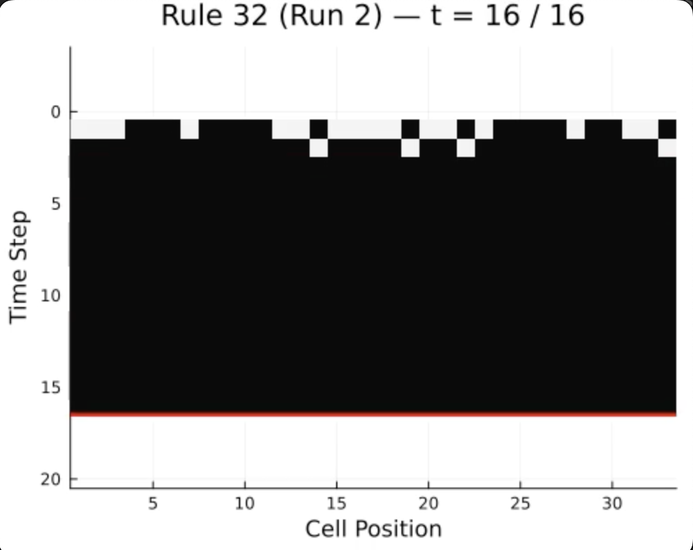
  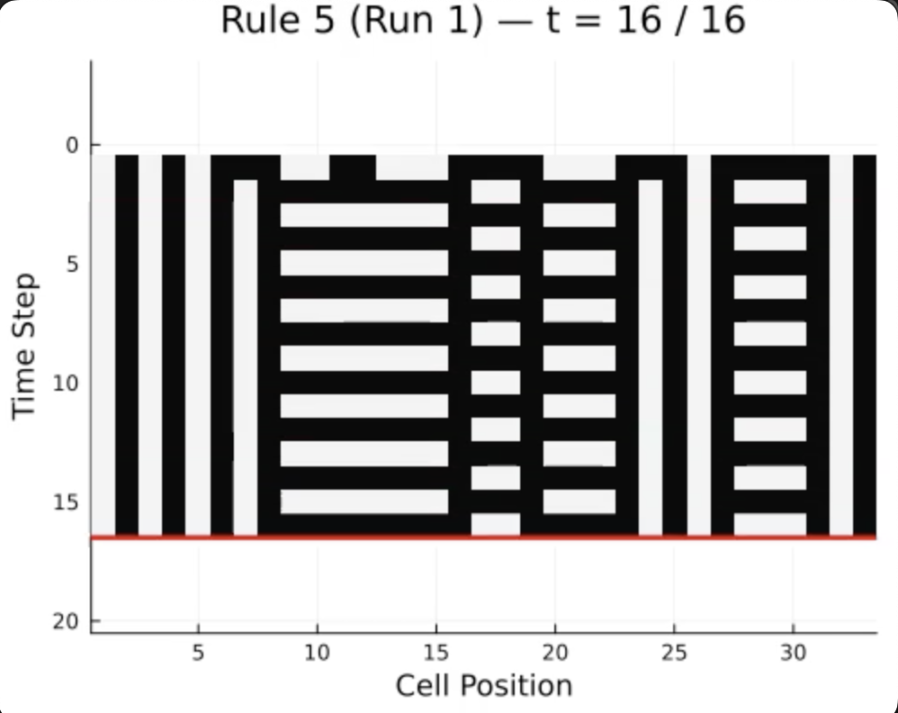
  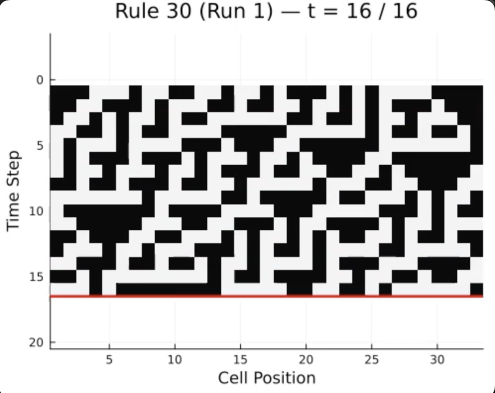
  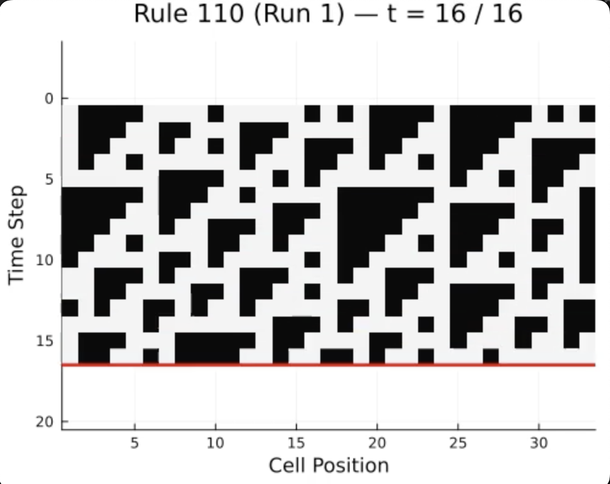
</p>

<p align="center">
  <em>Examples from each Wolfram class. Left to right: Class I (Rule 32), Class II (Rule 5), Class III (Rule 30), Class IV (Rule 110).</em>
</p>

<p align="center">
  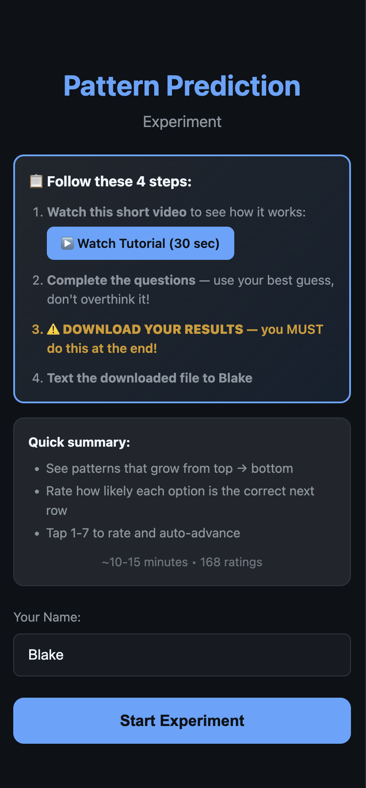
  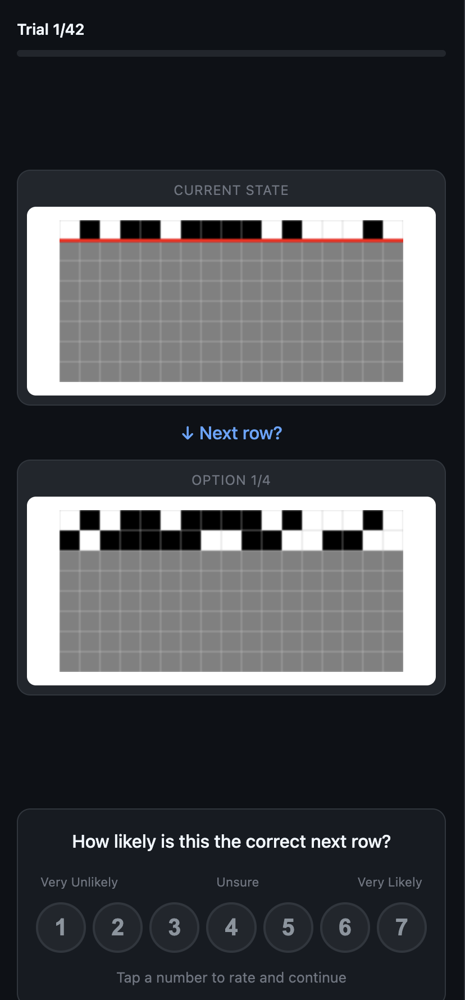
  
</p>

<p align="center">
  <em>Web experiment interface. Left: start page. Center: early trial (t=1). Right: late trial (t=6) with a chaotic rule.</em>
</p>

---

## Results

### Accuracy Over Time

<p align="center">
  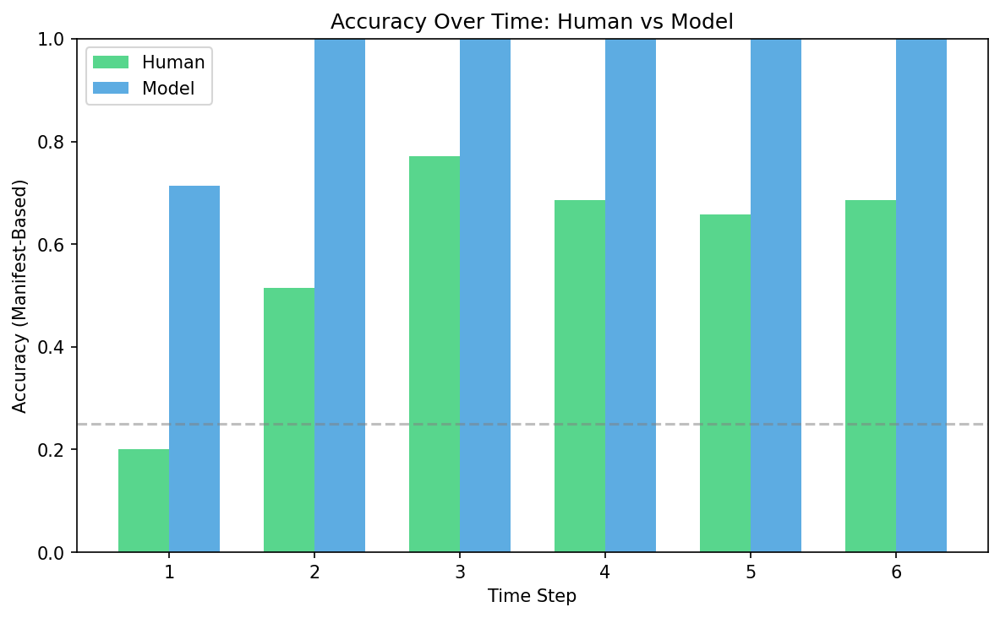
</p>

Both human and model accuracy exceed chance (25%). Human accuracy increases from 20% at *t*=1 to ~70% by *t*=3, then plateaus. The model reaches near-perfect accuracy after a single observation.

### Confidence in the Correct Option

<p align="center">
  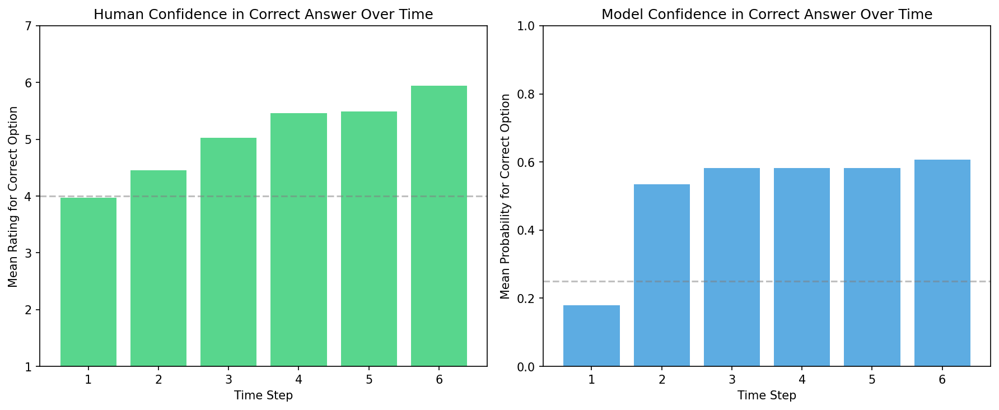
</p>

Human confidence in the correct answer rises steadily from ~4 (unsure) to ~6 (likely), while model probability increases more rapidly. Both exhibit evidence accumulation consistent with Bayesian updating.

### Human vs. Model by Wolfram Class

<p align="center">
  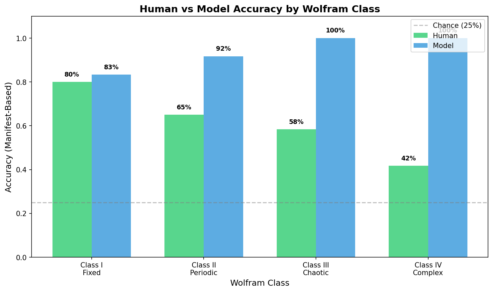
</p>

Class I (Fixed) rules are easiest for both humans (80%) and model (83%). The human–model gap widens with complexity: Class IV (Complex) rules yield only 42% human accuracy versus 100% for the model.

### Accuracy by Individual Rule

<p align="center">
  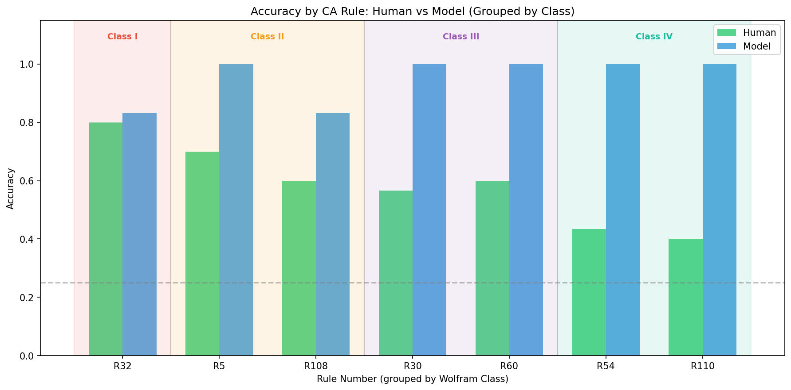
</p>

---

## Citation

If you use this work, please cite:

```bibtex
@article{edwards2025modeling,
  title={Modeling Human Inference of Simple Dynamical Rules: A Bayesian Program Induction Approach to Cellular Automata},
  author={Edwards, Blake},
  institution={Massachusetts Institute of Technology},
  year={2025}
}
```

---

## License

This project is licensed under the MIT License — see the [LICENSE](LICENSE) file for details.
